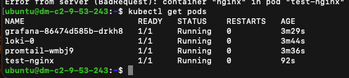
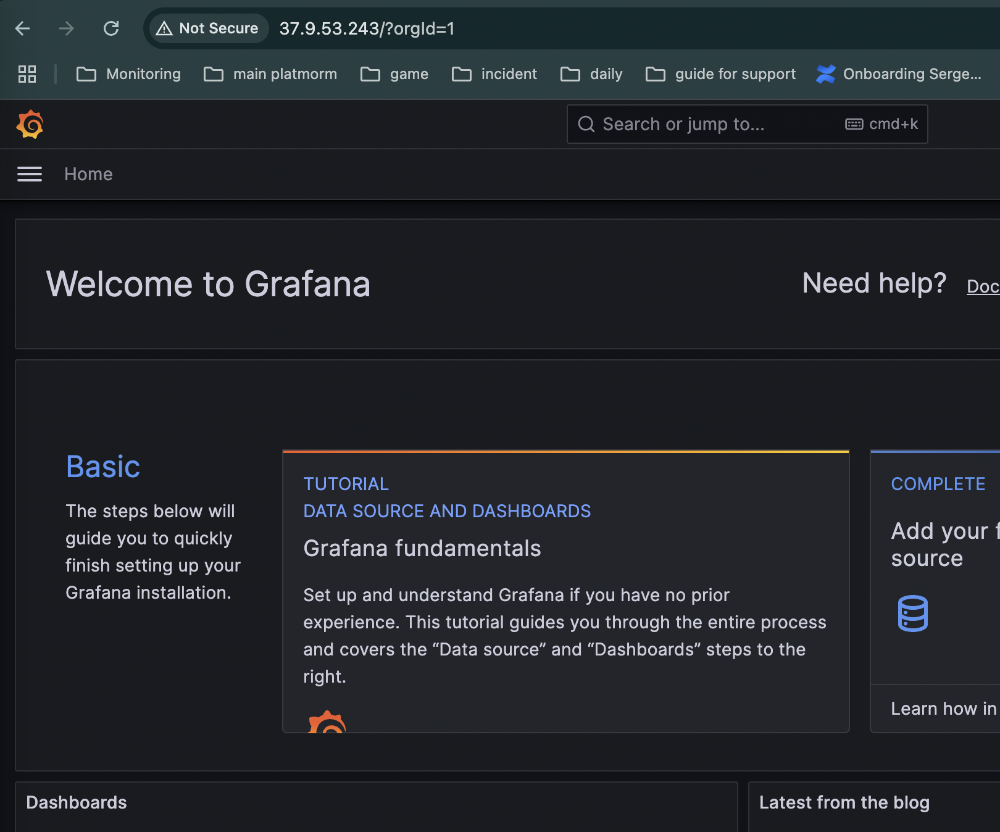
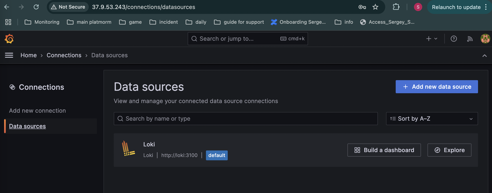

## Задание:

* Развернуть систему логирования на основе Loki, Promtail и Grafana в minikube.
* Развернуть тестовое приложение
* Настроить отправку логов из тестового приложения в loki. 
* подключить Loki к Grafana
* посмотреть логи тестового приложения в Grafana
* Подготовить helm chart  на основании манифестов из задания 2

## Решение:
## Задание 1
```bash
#установка docker
# 1. Установим зависимости
sudo apt update
sudo apt install -y curl wget apt-transport-https

# 2. Установим kubectl
curl -LO https://storage.googleapis.com/kubernetes-release/release/$(curl -s https://storage.googleapis.com/kubernetes-release/release/stable.txt)/bin/linux/amd64/kubectl
chmod +x kubectl
sudo mv kubectl /usr/local/bin/

# 3. Установим Minikube
curl -LO https://storage.googleapis.com/minikube/releases/latest/minikube-linux-amd64
sudo install minikube-linux-amd64 /usr/local/bin/minikube

sudo minikube start --driver=none

# 4. Установка Loki, Promtail и Grafana через Helm
curl https://raw.githubusercontent.com/helm/helm/master/scripts/get-helm-3 | bash

helm repo add grafana https://grafana.github.io/helm-charts
helm repo update

helm install loki grafana/loki-stack --set promtail.enabled=false

helm install promtail grafana/promtail

helm install grafana grafana/grafana --set adminPassword='admin' --set service.type=NodePort

kubectl get pods
```


```bash
#Развёртывание тестового приложения
#Создадим простое приложение на базе nginx:
test-app.yaml

# Настройка Promtail на сбор логов
kubectl get configmap promtail -o yaml

#Подключение Grafana к Loki
kubectl get svc grafana
minikube service grafana

#Установим MetalLB (пул IP адресов для кластера)
minikube addons enable metallb

# Внутри миникуб включил port-forward + настроил nginx для внешнего подключения в графане
while true; do
  kubectl port-forward svc/loki-grafana 8081:80 -n monitoring
  echo "Port-forward stopped. Restarting in 5 seconds..."
  sleep 5
done

cat /etc/nginx/conf.d/grafana-proxy.conf
server {
    listen 80;
    server_name 37.9.53.243;

    location / {
        proxy_pass http://localhost:8081;
        proxy_http_version 1.1;

        proxy_set_header Upgrade $http_upgrade;
        proxy_set_header Connection 'upgrade';
        proxy_set_header Host $host;
        proxy_cache_bypass $http_upgrade;

        proxy_set_header X-Real-IP $remote_addr;
        proxy_set_header X-Forwarded-For $proxy_add_x_forwarded_for;
        proxy_set_header X-Forwarded-Proto $scheme;
    }
}


```

http://37.9.53.243/ 
Login - admin
password - uK3e58wItvfP98dUA43aTnVBlkFCwZI8BdN6rMob



