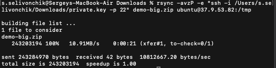
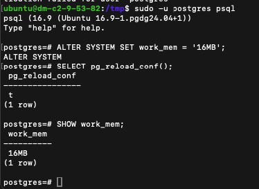
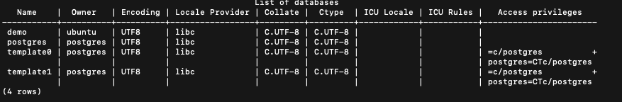
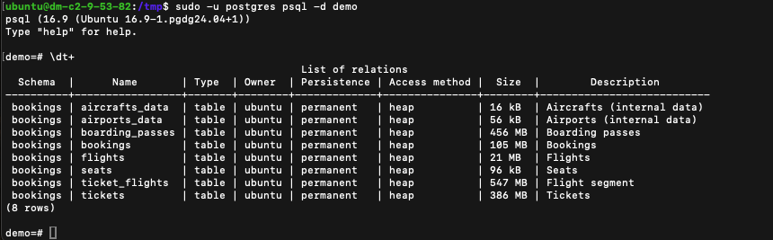
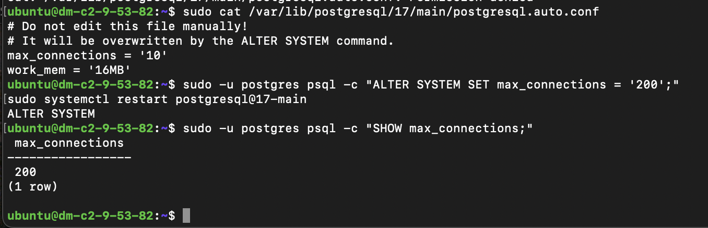
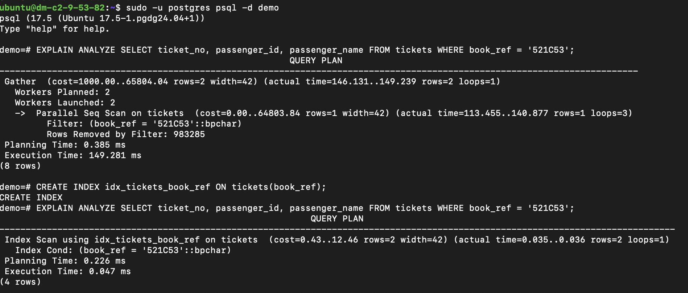

## Решение TASK1

1) Установка postgresql-16, unzip, sysbench через apt
```bash
sudo apt update

# Установка unzip и sysbench
sudo apt install -y unzip sysbench

# Добавление репозитория PostgreSQL 16
sudo apt install -y curl gnupg ca-certificates
curl -fsSL https://www.postgresql.org/media/keys/ACCC4CF8.asc | sudo gpg --dearmor -o /etc/apt/trusted.gpg.d/postgresql.gpg
echo "deb http://apt.postgresql.org/pub/repos/apt $(lsb_release -cs)-pgdg main" | sudo tee /etc/apt/sources.list.d/pgdg.list
sudo apt update
sudo apt install -y postgresql-16
```


2)Создание пользователя ubuntu с правами SUPERUSER в PostgreSQL

```bash
# Вход в PostgreSQL под системным пользователем postgres
sudo -u postgres psql
# Внутри psql выполнил:
CREATE USER ubuntu WITH PASSWORD 'ololo' SUPERUSER;
\q
```

3) Выполнение команд от имени пользователя ubuntu
```bash
sudo adduser ubuntu
sudo usermod -aG sudo ubuntu

su - ubuntu
```

4. Загрузка дампа demo-big.zip, распаковка и восстановление в БД
```bash
rsync -avzP -e "ssh -i /Users/s.selivonchik/Downloads/private.key -p 22" demo-big.zip ubuntu@37.9.53.82:/tmp
```




```bash
# расспаковка и восстановление дампа
sudo apt install unzip
unzip demo-big.zip

psql -U ubuntu -d demo -f /tmp/demo-big-20170815.sql
```

5. 
a) Меняем конфиг через конфигурационный файл postgresql.conf
```bash
sudo vim /etc/postgresql/16/main/postgresql.conf
sudo systemctl restart postgresql
# set - shared_buffers = 256MB
```
b) Меняем конфиг Через SQL-консоль (ALTER SYSTEM)
```bash
sudo -u postgres psql
# Выполни команду:
ALTER SYSTEM SET work_mem = '16MB';
# Применение изменений:
SELECT pg_reload_conf();
# Проверь, применилось ли:
SHOW work_mem;
```



```bash
psql -l 
```



```bash
sudo -u postgres psql -d demo
\dt+
```


## Решение TASK2
 
```bash
# Шаг 1: Убедиться, что sysbench установлен
sudo apt update
sudo apt install sysbench postgresql libpq-dev
# Шаг 2: Скачать demo_benchmark.lua
rsync -avzP -e "ssh -i /Users/s.selivonchik/Downloads/private.key -p 22" demo_benchmark.lua ubuntu@37.9.53.82:/tmp
# Шаг 3: Проверка доступа к базе PostgreSQL
psql -U ubuntu -h 127.0.0.1 -d demo
# Password - ololo
# Шаг 4: Запуск бенчмарка
sysbench \
  demo_benchmark.lua \
  --db-driver=pgsql \
  --pgsql-host=127.0.0.1 \
  --pgsql-port=5432 \
  --pgsql-user=ubuntu \
  --pgsql-password=ololo \
  --pgsql-db=demo \
  --threads=12 \
  --report-interval=15 \
  --time=30 \
  run

# АНАЛИЗ и ФИКС
# при запуске бенчмерча появилась ошибка об ограничении connections.Попробовал сначала проверить через команду фактическое ограничение - оказалось порог 10. хотя в postgresql.conf max_connections=200.
# Решил проверить postgresql.auto.conf тк он перезаписывает ostgresql.conf при запуске сервера . В этом файле данный параметр и перезаписывался , пришлось его поменять через ALTER SYSTEM SET.
sudo -u postgres psql -c "SHOW max_connections;"
sudo cat /var/lib/postgresql/17/main/postgresql.auto.conf

sudo -u postgres psql -c "ALTER SYSTEM SET max_connections = '200';"
sudo systemctl restart postgresql@17-main

```


## TASK3

```bash

#Диагностика
#Запрос с фильтром по book_ref выполнялся долго (149 мс).
#План показывал Parallel Seq Scan — полное сканирование таблицы.
#Причина — отсутствие индекса по полю book_ref.

#Решение
#Создан индекс:
CREATE INDEX idx_tickets_book_ref ON tickets(book_ref);

#Результат
#После создания индекса запрос стал использовать Index Scan.
#Время выполнения снизилось до 0.05 мс.

```

