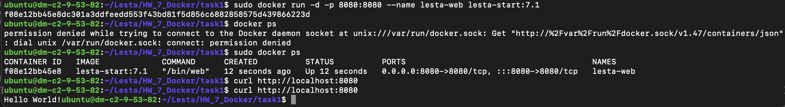
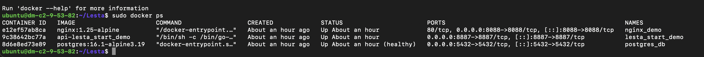
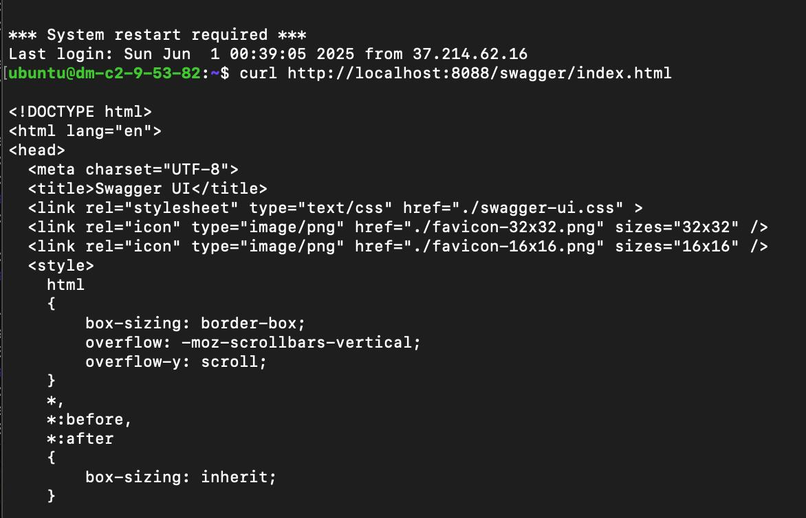

Домашнее задание к лекции 7. Docker
Задание 1
При помощи multi-stage собрать Docker образ простого web приложения на go
Docker image присвоить тэг lesta-start:7.1
Приложение работает на порту 8080
Опубликовать его на порту хоста, где запущен docker
main.go
package main
import (
 "fmt"
 "net/http"
)
func main() {
 http.HandleFunc("/", func(w http.ResponseWriter, r *http.Request) {
 fmt.Fprintf(w, "Hello World!")
 })
 http.ListenAndServe(":8080", nil)
}
подсказка
сборку осуществить командой 
go build -o /bin/web ./main.go
в контейнере запускать полученый bin файл
Задание 2
Во вложеном архиве расположен исходный код go-api. При помощи docker compose необходимо подготовить сборку и 
запуск приложения.
Dockerfile

## Задание:
Задание 1
```bash
cd Lesta/HW_7_Docker/task1
# Построить образ с тегом:
docker build -t lesta-start:7.1 .
# Запустить контейнер:
docker run -d -p 8080:8080 --name lesta-web lesta-start:7.1
# Приложение будет доступно по адресу: http://localhost:8080
```


Задание 2
```bash
cd Lesta/HW_7_Docker/api
# Построить образ с тегом:
docker-compose up --build
# http://localhost:8088/swagger/index.html
#Ты должен увидеть Swagger UI, и возможность выполнить:
#POST /api/throw
#GET /api/stats

```
# дополнительно настроил nginx на vm ,для проксирования трафика с http://37.9.53.82/swagger/index.html на http://localhost:8088/swagger/index.html




