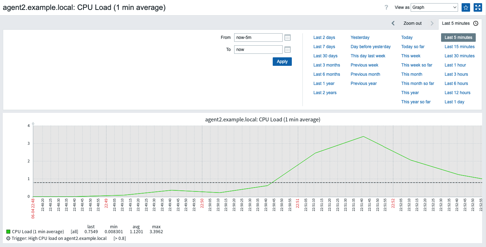

## Задание:

***Установить Zabbix Server на первом сервере***
* Установить необходимые зависимости.
* Развернуть Zabbix Server, Frontend и базу данных.
* Убедиться, что Zabbix Server успешно запущен и доступен через веб-интерфейс.
***Установить Zabbix Agent на втором сервере***
* Установить Zabbix Agent.
* Настроить его для подключения к Zabbix Server.
* Убедиться, что агент отображается как активный в интерфейсе Zabbix.
***Создать триггер***
* Добавить новый Item для отслеживания, например, загрузки CPU или доступности сервиса.
* Создать Trigger, который сработает при превышении заданного порога (например, загрузка CPU > 80%).
***Имитировать срабатывание триггера***
* Сознательно создать ситуацию, чтобы триггер сработал.
***Настроить отправку уведомлений в Telegram***
* Чат уже создан надо прописать его (Zabbix_lesta_start) https://t.me/+TH--mYT3Tfk1YWU6
Token: 7616687279:AAGpLoBW6Yx24FuVt0bDqi1-tcxS_o62tlE
ID чат: -4810009303
* Настроить Action в Zabbix для отправки уведомлений в Telegram при срабатывании триггера.
***Добавить в сообщение фамилию, от кого пришёл триггер***
* В уведомлении отобразить фамилию.
***ФОРМАТ СДАЧИ ДЗ***: выполнение ДЗ на наших машинах + уведомление от zabbix сервера в телеграм

## Решение:
Сервер 1 - 37.9.53.206
Сервер 2 - 37.9.53.82

## Задание 1 (37.9.53.206)
***Установить Zabbix Server на первом сервере***
```bash
# Установка Docker и Docker Compose
sudo apt update && sudo apt upgrade -y
sudo apt install -y docker.io docker-compose
sudo systemctl enable docker --now
# Добавим текущего пользователя в группу docker
sudo usermod -aG docker $USER
newgrp docker
# Клонируем папку zabbix-docker с docker-compose.yml
#Запуск контейнеров
docker-compose up -d
docker ps


# Переходим по ссылке:
http://37.9.53.206:8080/

# По умолчанию:
Login: Admin
Password: zabbix

```


## Задание 2 (37.9.53.82)
***Установить Zabbix Agent на втором сервере***
```bash
# Установка  docker.io 
sudo apt install docker.io
# Запуск контейнера Zabbix Agent
docker run -d \
  --name zabbix-agent \
  --restart unless-stopped \
  -p 10050:10050 \
  -e ZBX_SERVER_HOST="37.9.53.206" \
  -e ZBX_HOSTNAME="agent2.example.local" \
  -e ZBX_ALLOWED_HOSTS="37.9.53.206,172.17.0.1" \
  --user root \
  zabbix/zabbix-agent:alpine-6.4-latest

# открытие порта 
sudo ufw allow 10050/tcp

# Добавление хоста в Zabbix UI (http://37.9.53.206:8080/)
#Configuration → Hosts → Create host
Hostname: agent2.example.local
Agent interface IP: 37.9.53.82
#Во вкладке Templates:
Добавьте шаблон: Template OS Linux by Zabbix agent


```


## Задание 3 
***Создать триггер***


## Задание 4
***Имитировать срабатывание триггера***
```bash
docker exec -it 2201247c00cc sh
apk update && apk add stress-ng
# запускаем нагрузку:
stress-ng --cpu 8 --cpu-load 100 --vm 4 --vm-bytes 90% --timeout 5m
# результат нагрузочного тестирования ниже:
```



## Задание 5 
***Настроить отправку уведомлений в Telegram***

```bash
# Клонируем HW_9_Monitoring/zabbix-docker к себе на сервер

# Создаем рядом с docker-compose файл /myscript.sh и монтируем его в docker:
chmod +x alertscripts/myscript.sh
docker-compose down
docker-compose up -d
#после проделанных действий руками ставим curl на zabix-server (на перпективу нужно добавить докер файл и в нем сделать установку доп пакетов)
docker exec -u 0 -it zabbix-docker_zabbix-server_1 sh
apk update && apk add --no-cache curl
curl --version
# результат срабатывания тригера и отправки в телеграм:
```


