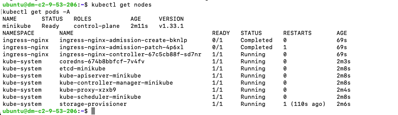
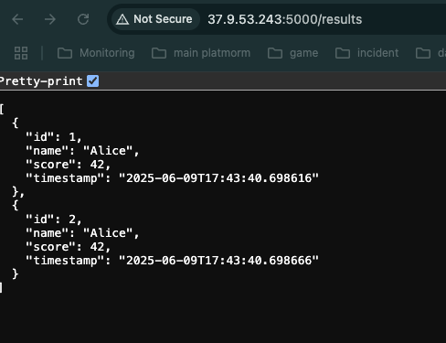
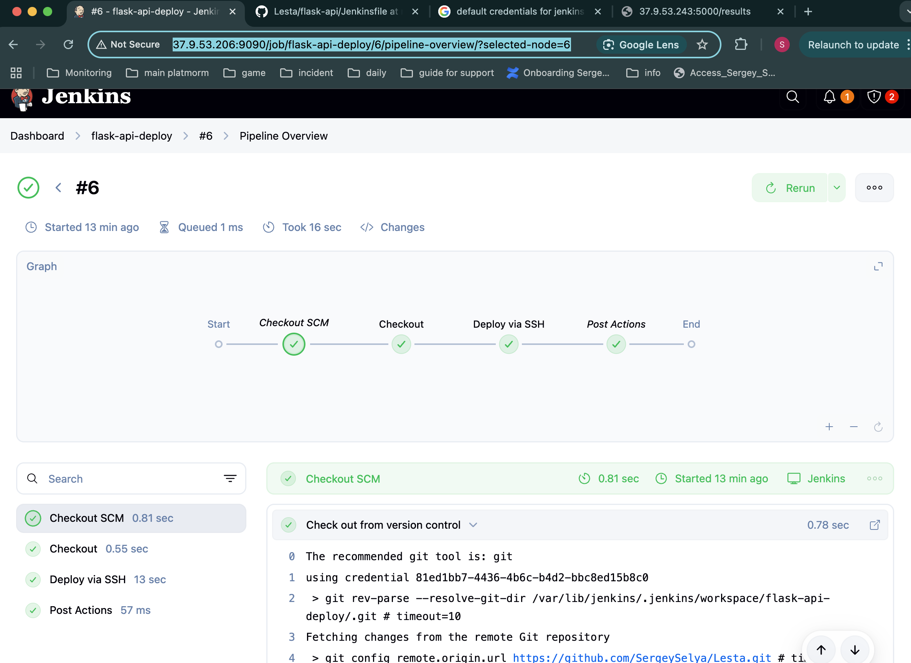

## Задание:

Задание 1:
•  Установить minikube  и запустить на нем кластер
•  Запустить на нем ingress controller
•  Установить kubectl

Задание 2:
Опубликовать приложение lesta-start:7.1 на кластере
•  подготовить deployment
•  подготовить service
•  подготовить ingress

Задание 3:
Подготовить helm chart  на основании манифестов из задания 2

## Решение:
## Задание 1
```bash
🧠 VM 1 (Jenkins): 37.9.53.206 — CI/CD пайплайн (тут работает Jenkins)
🚀 VM 2 (App target): 37.9.53.243 — удалённая машина, куда Jenkins будет деплоить

#Настройка SSH-доступа из Jenkins (на 37.9.53.206) в целевую машину (37.9.53.243)
#1.1 Генерация SSH-ключа на Jenkins-машине (37.9.53.206):

ssh-keygen -t rsa -b 4096 -C "jenkins-deploy" -f ~/.ssh/id_rsa_jenkins

# Добавляем публичный ключ на целевую машину
# На VM 2 (37.9.53.243):
mkdir -p ~/.ssh
echo "СЮДА ВСТАВИТЕ СОДЕРЖИМОЕ ~/.ssh/id_rsa_jenkins.pub ИЗ VM JENKINS" >> ~/.ssh/authorized_keys
chmod 600 ~/.ssh/authorized_keys

# проверяем на машине 37.9.53.206
ssh -i ~/.ssh/id_rsa_jenkins ubuntu@37.9.53.243

# Установка Jenkins на Ubuntu - 37.9.53.206 
sudo apt update && sudo apt upgrade -y
sudo apt install -y openjdk-17-jdk

curl -fsSL https://pkg.jenkins.io/debian-stable/jenkins.io-2023.key | sudo tee \
  /usr/share/keyrings/jenkins-keyring.asc > /dev/null

echo deb [signed-by=/usr/share/keyrings/jenkins-keyring.asc] \
  https://pkg.jenkins.io/debian-stable binary/ | sudo tee \
  /etc/apt/sources.list.d/jenkins.list > /dev/null

sudo apt update
sudo apt install -y jenkins
sudo systemctl enable jenkins
sudo systemctl start jenkins
sudo systemctl status jenkins


```



Ссылка на Jenkins - http://37.9.53.206:9090/
ENDPOINT - http://37.9.53.243:5000/results
